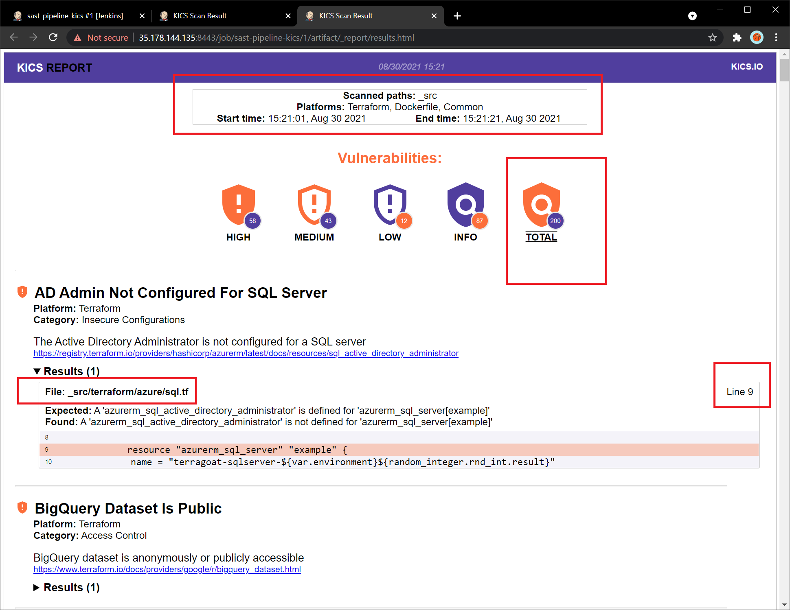

# Simple EC2 (SAST in Jenkins Pipeline)

1. CDK Project in TypeScript
2. EC2 Instance
3. Jenkins in Docker 
  * Jenkins exposed on HTTPS with a selfsigned certificate
  * Installation and configuration using JCasC
  * CI/CD Pipeline with Checkmarx Kics as SAST for IaC


## Steps

### 1. Setup AWS

This script will install all tools needed such as AWS CLI v2, CDK, Python, NodeJS, etc.
```sh
wget -qN https://raw.githubusercontent.com/chilcano/how-tos/master/src/devops_tools_install_v3.sh 

chmod +x devops_tools_*.sh  
. devops_tools_install_v3.sh --arch=[amd|arm] [--tf-ver=0.11.15-oci] [--packer-ver=1.5.5]
```

Now, configure AWS, you can set the AWS credential as System Environment Variables or as [AWS Named Profiles](https://docs.aws.amazon.com/cli/latest/userguide/cli-configure-profiles.html). I recommend the last one, before listing the created profiles.
```sh
aws configure list-profiles
```
Create it if it has not been created.
```sh
aws configure --profile es

AWS Access Key ID [None]: AKI...
AWS Secret Access Key [None]: AvO...
Default region name [None]: eu-west-2
Default output format [None]: json
```

An annoying thing to do everytime you start working with a fresh project is creating a SSH key-pair, for that I've created a bash script that creates a new SSH key-pair in local and upload it to specific or to all AWS' regions. By default this script will create the SSH key-pair in all regions unless configured. 
```sh
export AWS_PROFILE=es
source <(curl -s https://raw.githubusercontent.com/chilcano/how-tos/master/src/import_ssh_pub_key_to_aws_regions.sh)
```

### 2. Install and setup CDK

First of all, update CDK. 
```sh
sudo npm install -g aws-cdk
```

To create an empty CDK project, execute next commands. 
```sh
mkdir simple-ec2 && cd simple-ec2
cdk init --language=typescript
```

But in this case, you don't need it because you can clone this repository. Once cloned, just install all packages required.

```sh
git clone https://github.com/chilcano/aws-cdk-examples.git
cd aws-cdk-examples/simple-ec2/
npm install @aws-cdk/aws-ec2 @aws-cdk/aws-iam dotenv
```

### 3. Deploy

Now, we are going to execute our CDK project using the AWS Profile already configured (`--profile es`).
```sh
cdk list --profile es

cdk synth --profile es

cdk deploy --profile es --require-approval never --outputs-file output.json
```

This CDK project will generate the `output.json` file with the public IP and Hostname needed in the next step.

### 4. Accessing the EC2 Instance

I require above `output.json` and `~/.ssh/tmpkey` files. Then, make sure both files have been created successfully.
```sh
ssh ubuntu@$(jq -r .SimpleEc2Stack.NODEIP output.json) -i ~/.ssh/tmpkey
```

Now, check if `user_data_ubuntu_reqs.sh` bash script was executed successfully. Although, in this case, it only pre-installs Git, Docker and Java.
```sh
tail -fn 9000 /var/log/cloud-init-output.log
```

You should see this if it worked without errors.
 ```sh
...
Docker version 20.10.7, build 20.10.7-0ubuntu1~20.04.1
docker-compose version 1.25.0, build unknown
openjdk 11.0.11 2021-04-20
Cloud-init v. 21.2-3-g899bfaa9-0ubuntu2~20.04.1 running 'modules:final' at Wed, 25 Aug 2021 14:35:40 +0000. Up 14.93 seconds.
Cloud-init v. 21.2-3-g899bfaa9-0ubuntu2~20.04.1 finished at Wed, 25 Aug 2021 14:36:27 +0000. Datasource DataSourceEc2Local.  Up 61.41 seconds
```

### 5. Jenkins in Docker and Jenkins configuration as code (JCasC)

In order to install Jenkins in an automated way and avoid to configure initial user, enable HTTPS and install plugins, I'm going to user [JCasC](https://www.jenkins.io/projects/jcasc/) approach. Execute next commands from EC2 instance Terminal.
```sh
git clone https://github.com/chilcano/aws-cdk-examples.git 

cd aws-cdk-examples/simple-ec2/_scripts/jcasc/src/

sudo ./jenkins_docker_build.sh
```

Check if `jenkins/jcasc` Docker image has been created.
```sh
sudo docker images
```

Once built, run the custom image by running `docker run` command.
```sh
sudo ./jenkins_docker_run.sh

Starting Docker Jenkins container.
Get access to Jenkins UI with 'admin/IQ3+wFJUB8Rd0FW9Oc6dNyaxHQKm4va7'.
bdddd5fe0e757ce7165ac612bfdb712cd548f2629370107f909810120d8fa6dd
```
> Note that previous script will generate a random password that you have to use when logging in Jenkins UI.

Check if the `jcasc` docker instance is running.
```sh
sudo docker ps -a
```

Once verified the installation, let's get access to Jenkins over HTTPS. Execute the next command from your Terminal where deployed the CDK project.
```sh
JENKINS_LOCAL_URL_HTTPS=https://$(jq -r .SimpleEc2Stack.NODEIP output.json):8443; echo $JENKINS_LOCAL_URL_HTTPS
```
Now, only open the above URL in your browser and enter the initial Jenkins user and password created in the above JCasC process. 


### 6. Creating a SAST Jenkins Pipelines


#### 6.1. Checkmarx Kics to scan IaC (Dockerfile, Kubernetes, Terraform, CloudFormation, etc.)


Once finished the installation and configuration of Jenkins, I'm going to create a simple Pipeline that scans for vulnerabilities in the code of a GIT repository.
Specifically, I'll use Kics, it will scan for errors in our infrastructure as code (IaC) and will generate reports in HTML and Json.

Only, you need to copy the content of [`simple-ec2/_scripts/sast-pipeline-kics.groovy`](../simple-ec2/_scripts/sast-pipeline-kics.groovy) in Jenkins as a Pipeline from Jenkins UI. 

Once created the Jenkins Pipeline, you should click over *Build with Parameters* and enter a Git repository URL to be scanned by Kics.   
Example of Git repositories:
* [TerraGoat](https://github.com/bridgecrewio/terragoat.git): It is a "Vulnerable by Design" Terraform repository.
* [Sock Shop](https://github.com/microservices-demo/microservices-demo.git): It is a Microservice Demo Application

When the pipeline execution has been finished, you will see the reports in HTML and Json generated by Kics in the Jenkins Workspace.





#### 6.2. Full stack Pipeline (Python, Golang, Yaml, etc.)


In this Jenkins Pipeline I am going to use the next Linters:

1. Yaml Linter
2. Golang Linter
3. Python Linter

Also, I'm going to use these Jenkins Plugins:
1. [archiveArtifacts](https://www.jenkins.io/doc/pipeline/steps/core/)
2. [publishHTML](https://www.jenkins.io/doc/pipeline/steps/htmlpublisher/)
3. [Warnings-NG / recordIssues / tools: yamlLint, pyLint and goLint](https://www.jenkins.io/doc/pipeline/steps/warnings-ng/)

If you want add more Linters because you added Java and NodeJS code, then, You can found other linters in this list: [SAST in your SDLC for Cloud-Native Apps](https://holisticsecurity.io/2021/07/06/sast-in-sdlc-for-cloud-native-apps/).
Now, let's create a new Pipeline, then, copy the content of [`simple-ec2/_scripts/sast-pipeline-full-stack.groovy`](../simple-ec2/_scripts/sast-pipeline-full-stack.groovy) in Jenkins as a new Pipeline from Jenkins UI. 

Once created the new Pipeline, you should click over *Build with Parameters* and enter a Git repository URL to be scanned by all above Linters, even Kics.   
Example of Git repositories:
* [AWS-CDK-Examples](https://github.com/chilcano/aws-cdk-examples.git): This same repository. A set of samples I used to experiment with AWS CDK.
* [Vulnerability-Goapp](https://github.com/Hardw01f/Vulnerability-goapp.git): A vulnerable golang Web application for education

Once the pipeline is running, you will see 4 new links in the Jenkins user interface sidebar, each of them being links to each Report that each Linter has generated.


20210904-sast-in-your-cicd-pipeline-full-stack-1-create.png


### 7. Destroy the Instance

From Terminal where deployed the CDK project, run the next command to destroy the entire stack and all AWS resources created.
```sh
cdk destroy --profile es 
```

## Troubleshooting

1. Enable Content-Security-Policy HTTP header in Jenkins  
> [https://github.com/Checkmarx/kics/blob/master/docs/integrations_jenkins.md](https://github.com/Checkmarx/kics/blob/master/docs/integrations_jenkins.md)


## Reference

1. https://dev.to/emmanuelnk/part-3-simple-ec2-instance-awesome-aws-cdk-37ia
2. https://www.digitalocean.com/community/tutorials/how-to-automate-jenkins-setup-with-docker-and-jenkins-configuration-as-code
3. Jenkins Configuration as Code: https://www.jenkins.io/projects/jcasc/
4. Available Jenkins Plugins for JCasC: https://github.com/jenkinsci/jenkins/blob/master/core/src/main/resources/jenkins/install/platform-plugins.json
5. JCasC in Docker example: https://github.com/ultrabright/docker-jenkins
6. TerraGoat - Vulnerable Terraform Infrastructure: https://github.com/bridgecrewio/terragoat.git