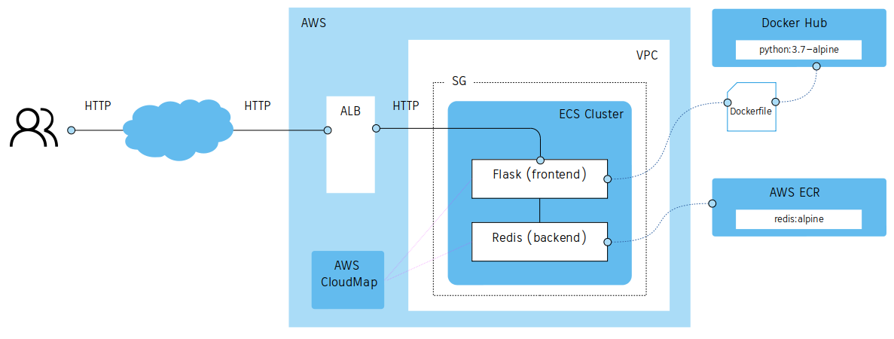

# Simple Frontend-Backend Application

>  
>  This CDK example was inspired by the Jeff Bryner's article about [Taking AWS CDK for a spin for deploying docker containers](https://blog.jeffbryner.com/2020/07/20/aws-cdk-docker-explorations.html).  
>  Jeff used AWS CDK with Python, but in this sample I'm going to use TypeScript, that is only difference.
>  



## 1. Steps

### 1.1. Requisites

```sh
$ aws --version
aws-cli/1.18.69 Python/3.8.2 Linux/5.4.0-42-generic botocore/1.16.19

$ cdk --version
1.57.0 (build 2ccfc50)

$ nodejs -v
v10.19.0

$ npm -v
6.14.4

$ docker -v
Docker version 19.03.8, build afacb8b7f0
```

### 1.2. Initialize the project

```sh
$ git clone https://github.com/chilcano/aws-cdk-samples
$ cd aws-cdk-samples/simple-frontend-backend-ecs
$ nmp install
```

### 1.3. Check the code

All infrastructure as code is in `lib/simple-frontend-backend-ecs-stack.ts` TypeScript file, and if you want to review the CloudFormation code, execute this command:
```sh
$ cdk synth
```

### 1.4. Deploy in you AWS account
 
 ```sh
$ cdk deploy
```


### 1.5. Calling the app

If `cdk deploy` went successfully you will get an output with the URLs to call your service or web application.


In this case they are:
- FeSvcLoadBalancerDNS64A4F716
- BeSvcLoadBalancerDNSF8CEC0A3

Or you can get from CloudFormation code using `cdk synth`:
```yaml
[...]
Outputs:
  FeSvcLoadBalancerDNS64A4F716:
    Value:
      Fn::GetAtt:
        - FeSvcLB7C362FA9
        - DNSName
  BeSvcLoadBalancerDNSF8CEC0A3:
    Value:
      Fn::GetAtt:
        - BeSvcLB94714458
        - DNSName

[...]
```

Other way to get the output is using `aws cloudformation describe-stacks`:  
```sh
$ aws cloudformation describe-stacks --stack-name SimpleFrontendBackendEcsStack --query "Stacks[0].Outputs[]" --output text

FeSvcLoadBalancerDNS64A4F716	Simpl-FeSvc-J28DITCDXP1G-f19578fd1a60d01e.elb.us-east-1.amazonaws.com
BeSvcLoadBalancerDNSF8CEC0A3	Simpl-BeSvc-UWFPH8XP3ZKD-c2fb41c1de254eb5.elb.us-east-1.amazonaws.com
```  

Now, open above URL in your browser, you should see this:  


If for any reason you have changed the code, you should be aware don't change the `serviceName` (`frontend` and `backend`) registered in AWS Cloud Map because you will get the below error.   
The Frontend Container (Python Flask Web App) will call to Backend Container (Redis) using `backend` as service name:  


If you try to open the `BeSvcLoadBalancerDNSF8CEC0A3` URL in your browser, you will get this error, which is fine and means you can call the Backend from Internet and your Application has been configured and deployed in right and secure way.


### 1.6. Cleaning up

```sh
$ cdk destroy
``` 

## 2. References

1. [Taking AWS CDK for a spin for deploying docker containers](https://blog.jeffbryner.com/2020/07/20/aws-cdk-docker-explorations.html): This is the Jeff Bryner's article which inspired me.
2. [Docker ♥️ AWS – A match made in heaven](https://www.youtube.com/watch?v=RfQrgZFq_P0): This is the explanation and demo that Chad Metcalf did about migrating a Frontend/Backend Application based on Docker Compose to AWS ECS. This Git repo uses the same Application and Docker containers. 