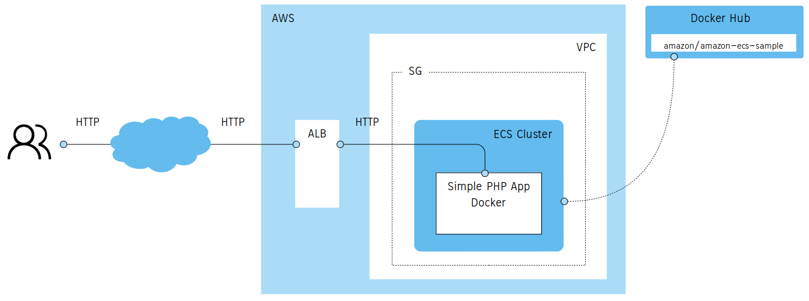
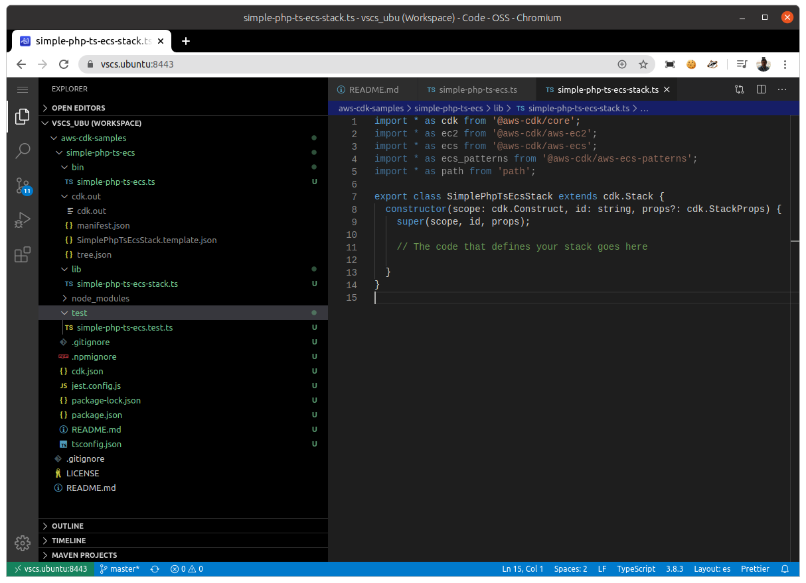
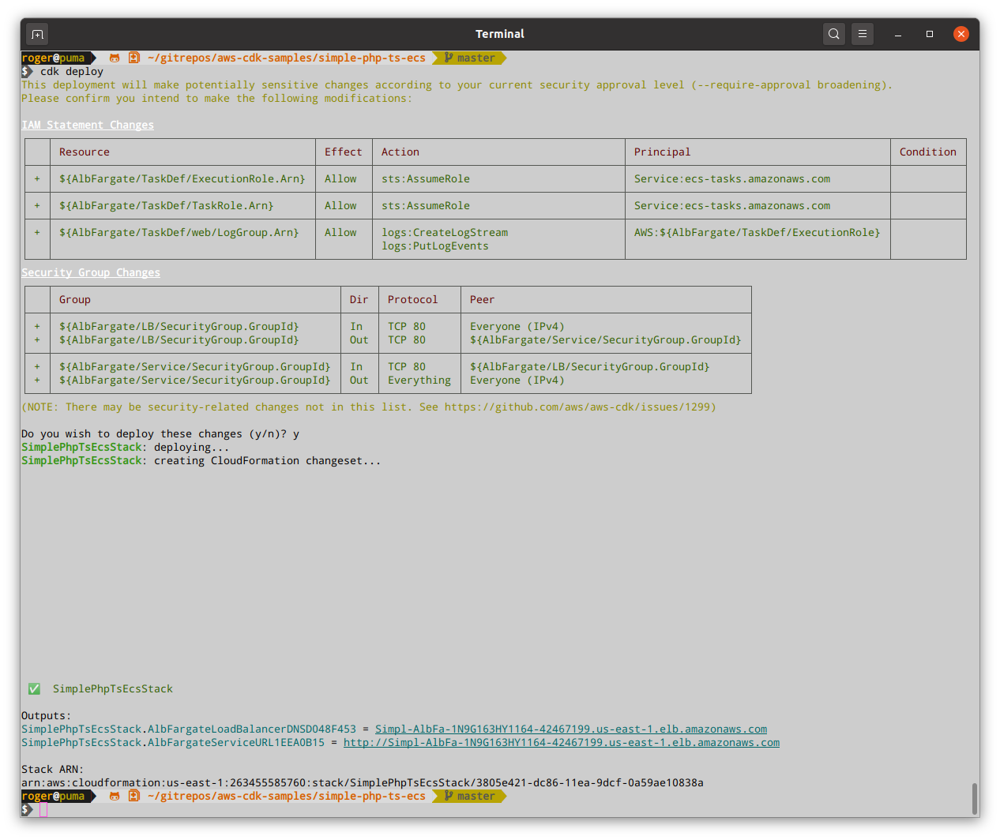
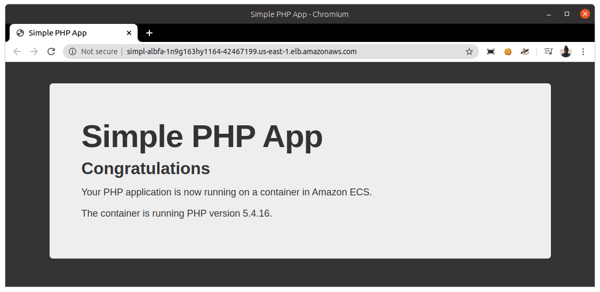

# Simple PHP Application

__Type:__   
- TypeScript
- ECS
- Fargate
- ALB

__Architecture:__



## 1. Steps

### 1.1. CDK Installation

```sh
$ sudo apt install -y nodejs npm

$ nodejs -v
v10.19.0

$ npm -v
6.14.4

$ sudo npm i -g aws-cdk
/usr/local/bin/cdk -> /usr/local/lib/node_modules/aws-cdk/bin/cdk
+ aws-cdk@1.57.0
added 216 packages from 186 contributors in 5.464s
``` 

### 1.2. Initialize the CDK project

```sh
$ mkdir simple-php-ts-ecs && cd simple-php-ts-ecs
$ cdk init --language=typescript
```
`cdk init` will generate an empty TypeScript project:


### 1.3. Write your code

Import modules to your project.
```sh
$ npm install @aws-cdk/aws-ec2 @aws-cdk/aws-ecs @aws-cdk/aws-ecs-patterns
``` 

Implement your infrastructure writting the code below:
```sh
$ nano simple-php-ts-ecs/lib/simple-php-ts-ecs-stack.ts
``` 

```ts
import * as cdk from '@aws-cdk/core';
import * as ec2 from '@aws-cdk/aws-ec2';
import * as ecs from '@aws-cdk/aws-ecs';
import * as ecs_patterns from '@aws-cdk/aws-ecs-patterns';
import * as path from 'path';

export class SimplePhpTsEcsStack extends cdk.Stack {
  constructor(scope: cdk.Construct, id: string, props?: cdk.StackProps) {
    super(scope, id, props);

    // The code that defines your stack goes here
    const vpc = new ec2.Vpc(this, "SamplePhpVpc", {
      maxAzs: 3
    });

    const cluster = new ecs.Cluster(this, "EcsCluster", {
      vpc: vpc
    })

    new ecs_patterns.ApplicationLoadBalancedFargateService(this, "AlbFargate", {
      cluster: cluster,         // required
      cpu: 512,                 // default is 256
      desiredCount: 3,          // default is 1
      taskImageOptions: {image: ecs.ContainerImage.fromRegistry("amazon/amazon-ecs-sample")},
      memoryLimitMiB: 2048,     // default is 512
      publicLoadBalancer: true  // default is false
    })

  }
}
```

### 1.4. Check the generated CloudFormation script

```sh
$ cdk synth
```

### 1.5. Deploy in you AWS account

Once AWS account has been configured you will be able to deploy your CDK project in your cloud. If so, you will have this error message:
```
Unable to resolve AWS account to use. It must be either configured when you define your CDK or through the environment
```

Deploying it: 
```sh
$ cdk deploy
``` 



### 1.6. Calling the app

```sh
$ curl -v -o /dev/null -s http://simpl-albfa-1n9g163hy1164-42467199.us-east-1.elb.amazonaws.com

*   Trying 34.225.26.163:80...
* TCP_NODELAY set
* Connected to simpl-albfa-1n9g163hy1164-42467199.us-east-1.elb.amazonaws.com (34.225.26.163) port 80 (#0)
> GET / HTTP/1.1
> Host: simpl-albfa-1n9g163hy1164-42467199.us-east-1.elb.amazonaws.com
> User-Agent: curl/7.68.0
> Accept: */*
> 
* Mark bundle as not supporting multiuse
< HTTP/1.1 200 OK
< Date: Wed, 12 Aug 2020 10:00:13 GMT
< Content-Type: text/html; charset=UTF-8
< Content-Length: 941
< Connection: keep-alive
< Server: Apache/2.4.39 () PHP/5.4.16
< Upgrade: h2,h2c
< X-Powered-By: PHP/5.4.16
< 
{ [941 bytes data]
* Connection #0 to host simpl-albfa-1n9g163hy1164-42467199.us-east-1.elb.amazonaws.com left intact

``` 
Or open above URL in your browser, you should see this:


### 1.7. Cleaning up

```sh
$ cdk destroy
``` 
